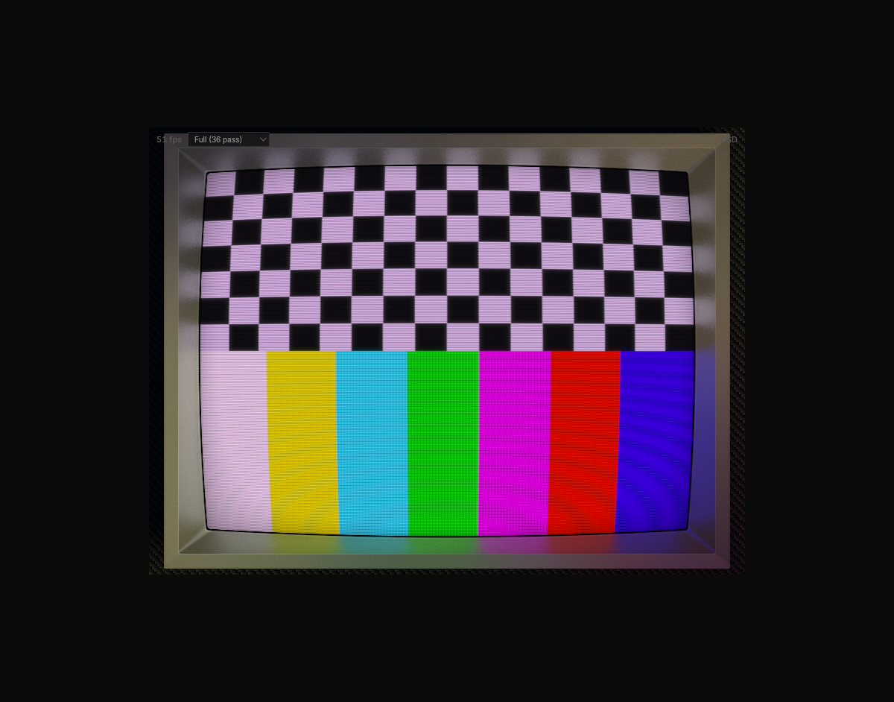

# Mega Bezel Reflection Shader for the Web

The full [Mega Bezel Reflection Shader](https://forums.libretro.com/t/hsm-mega-bezel-reflection-shader-feedback-and-updates) running in the browser. 36 shader passes compiled from RetroArch's slang pipeline to WebGL2 via WASM.

CRT scanlines, phosphor mask, barrel curvature, bloom, monitor bezel frame with textures, screen reflections, night lighting -- the whole thing.



## Quick Start

```bash
# Install dependencies
npm install

# Serve the demo (WASM binaries included -- no build step needed)
python3 -m http.server 8095
```

Open `http://localhost:8095/demo/render-test.html`. Press **Tab** to open the parameter OSD.

For the React app: `npm run dev` then open `http://localhost:5173`.

## Demo Controls

| Key | Action |
|-----|--------|
| Tab | Toggle OSD parameter panel |
| Up / Down | Navigate parameters |
| Left / Right | Adjust value (Shift for 10x) |
| R | Reset parameter to default |
| PageUp / PageDown | Switch OSD tab |

The HUD has a quality tier selector (Full 36-pass / Medium 3-pass / Low 2-pass) and FPS counter.

## Using in Your Project

### 1. Copy the required files

Your project needs these files served statically:

```
public/
  dist/wasm/
    mega-bezel.js          # Emscripten module loader
    mega-bezel.wasm        # Compiled WASM binary
  shaders/
    mega-bezel/            # Shader presets, passes, textures
      MBZ__3__STD__GDV-local.slangp
      shaders/
        base/              # Core mega-bezel shaders + includes
        guest/             # CRT guest advanced shaders
        dogway/            # Color correction shaders
        fxaa/              # Anti-aliasing
        custom/            # Simple bezel shaders
        textures/          # LUT tables, frame textures, backgrounds
    blurs/
      shaders/royale/      # Blur passes used by reflection pipeline
  include/
    compat_macros.inc      # HLSL-to-GLSL compatibility macros
```

### 2. Add the script tag

```html
<script src="/dist/wasm/mega-bezel.js"></script>
```

### 3. Use the MegaBezel class

```typescript
import { MegaBezel } from './lib/MegaBezel'

// Create instance with your canvas element
// The canvas MUST have an id attribute
const mb = new MegaBezel({
  canvas: document.getElementById('my-canvas'),
  wasmUrl: '/dist/wasm/mega-bezel.wasm'  // optional, this is the default
})

// Initialize (loads WASM, creates WebGL2 context)
await mb.init()

// Load a preset (fetches shaders, textures, resolves includes)
await mb.loadPreset(
  '/shaders/mega-bezel/MBZ__3__STD__GDV-local.slangp',
  '/shaders/mega-bezel'  // base URL for resolving relative paths
)

// Render loop -- pass any FrameSource each frame
function loop() {
  mb.renderFrame(myFrameSource)
  requestAnimationFrame(loop)
}
requestAnimationFrame(loop)

// Clean up when done
mb.destroy()
```

### Frame Sources

`renderFrame()` accepts any of these as input:

```typescript
type FrameSource =
  | HTMLCanvasElement    // e.g. an emulator rendering to a canvas
  | HTMLVideoElement     // video playback
  | HTMLImageElement     // static image
  | ImageBitmap          // decoded image
  | OffscreenCanvas      // web worker rendering
  | ImageData            // raw pixel data
```

### React Example

```tsx
import { MegaBezel } from './lib/MegaBezel'
import { useEffect, useRef } from 'react'

export function CRTScreen({ videoRef }) {
  const canvasRef = useRef(null)
  const mbRef = useRef(null)

  useEffect(() => {
    const canvas = canvasRef.current
    let disposed = false

    ;(async () => {
      const mb = new MegaBezel({ canvas })
      mbRef.current = mb
      await mb.init()
      await mb.loadPreset(
        '/shaders/mega-bezel/MBZ__3__STD__GDV-local.slangp',
        '/shaders/mega-bezel'
      )

      const loop = () => {
        if (disposed) return
        mb.renderFrame(videoRef.current)  // feed video frames
        requestAnimationFrame(loop)
      }
      requestAnimationFrame(loop)
    })()

    return () => {
      disposed = true
      mbRef.current?.destroy()
    }
  }, [])

  return <canvas ref={canvasRef} id="crt" width={800} height={600} />
}
```

### Vanilla JS Example

```html
<canvas id="output" width="800" height="600"></canvas>
<script src="/dist/wasm/mega-bezel.js"></script>
<script type="module">
  import { MegaBezel } from './lib/MegaBezel.js'

  const mb = new MegaBezel({
    canvas: document.getElementById('output'),
    wasmUrl: '/dist/wasm/mega-bezel.wasm'
  })

  await mb.init()
  await mb.loadPreset(
    '/shaders/mega-bezel/MBZ__3__STD__GDV-local.slangp',
    '/shaders/mega-bezel'
  )

  // Feed frames from a video element
  const video = document.getElementById('my-video')
  function loop() {
    mb.renderFrame(video)
    requestAnimationFrame(loop)
  }
  video.addEventListener('play', () => requestAnimationFrame(loop))
</script>
```

## Building the WASM Module

Requires the [Emscripten SDK](https://emscripten.org/docs/getting_started/downloads.html).

```bash
cd build
emmake make -j4
```

Output: `dist/wasm/mega-bezel.js` and `dist/wasm/mega-bezel.wasm`

To enable verbose shader debug logging during development:

```bash
# Add -DMBZ_DEBUG to COMMON_FLAGS in build/Makefile
emmake make -j4
```

## How It Works

The pipeline extracts RetroArch's shader subsystem into standalone C/C++ compiled to WASM:

1. **Shader loading** -- Preset files (`.slangp`) reference shader passes (`.slang`), include files (`.inc`), and textures (`.png`). The `PresetLoader` fetches everything from your server and writes it to Emscripten's in-memory filesystem (MEMFS).

2. **Shader compilation** -- Each `.slang` file is compiled through: Vulkan GLSL -> glslang (SPIR-V) -> SPIRV-Cross (GLES 300 ES) -> WebGL2 shader programs. This happens inside WASM using the same compiler RetroArch uses.

3. **Rendering** -- The `gl3_filter_chain` runs all 36 passes per frame: input capture, FXAA, color correction, CRT simulation (scanlines, curvature, phosphor mask, bloom), bezel generation, height maps, tube layers, gaussian blur, reflection preparation, bezel reflection compositing, and final output.

4. **Texture handling** -- PNG textures are decoded in JavaScript (via canvas 2D), converted to a raw format (width + height header + RGBA pixels), and written to MEMFS where the C code uploads them as GL textures.

## Project Layout

```
native/                         C/C++ source for the WASM module
  bridge.c                      Preset parsing bridge
  bridge_compiler.cpp           Shader compilation bridge
  bridge_renderer.cpp           Render pipeline bridge
  gfx/drivers_shader/           RetroArch shader pipeline (extracted)
    shader_gl3.cpp              GL3 filter chain + SPIRV-Cross
    slang_process.cpp           Slang shader processing
    slang_reflection.cpp        SPIR-V reflection
    glslang.cpp                 glslang compiler wrapper
  deps/                         glslang, SPIRV-Cross, libretro-common

build/
  Makefile                      Emscripten build

src/lib/                        TypeScript library
  MegaBezel.ts                  Main API class
  WasmBridge.ts                 cwrap bindings to WASM functions
  PresetLoader.ts               Asset fetching + MEMFS management
  FrameFeeder.ts                Frame source -> RGBA extraction
  types.ts                      TypeScript types

src/pages/
  ShaderTest.tsx                React demo page

demo/
  render-test.html              Standalone demo with progress bar

public/shaders/                 Shader assets (served statically)
  mega-bezel/                   Mega Bezel preset + shaders + textures
  blurs/                        Shared blur shaders
```

## Available Presets

The `MBZ__3__STD__GDV-local.slangp` preset is the full 36-pass Standard GDV pipeline. Simpler presets are also included for testing:

| Preset | Passes | What it does |
|--------|--------|-------------|
| `MBZ__3__STD__GDV-local.slangp` | 36 | Full mega-bezel with CRT, bezel, reflections |
| `crt-with-frame.slangp` | 3 | CRT effects + procedural frame |
| `crt-simple.slangp` | 2 | Scanlines, curvature, bloom |
| `ultra-simple-bezel.slangp` | 1 | Game + frame texture overlay |

## Runtime Parameters

The mega-bezel exposes ~1000 tunable parameters. Adjust them at runtime via the OSD (press Tab in the demo) or programmatically:

```typescript
// Set a parameter by name
mb.setParameter('HSM_CRT_CURVATURE_SCALE', 0.5)
mb.setParameter('post_br', 1.5)  // post-CRT brightness
mb.setParameter('HSM_GLOBAL_GRAPHICS_BRIGHTNESS', 120)
```

Or set defaults in the `.slangp` preset file:

```ini
HSM_INTRO_WHEN_TO_SHOW = 0
HSM_SHOW_PASS_INDEX = 0
HSM_CRT_CURVATURE_SCALE = 1.0
```

## Performance Tiers

For lower-end hardware, switch to a lighter preset:

| Tier | Preset | Passes | GPU Load |
|------|--------|--------|----------|
| Full | `MBZ__3__STD__GDV-local` | 36 | Heavy -- dedicated GPU recommended |
| Medium | `crt-with-frame` | 3 | Moderate -- most integrated GPUs |
| Low | `crt-simple` | 2 | Light -- works on mobile |

The demo includes a live tier switcher in the HUD. In code, just call `loadPreset()` with a different preset path.

## CI

GitHub Actions automatically rebuilds the WASM binaries when `native/` or `build/` files change on push to main. The built artifacts are committed back to `dist/wasm/`.

## Credits

- [HyperspaceMadness](https://github.com/HyperspaceMadness/Mega_Bezel) -- Mega Bezel Reflection Shader
- [Guest.r](https://github.com/guestrr) -- CRT Guest Advanced shader
- [Dogway](https://github.com/dogway) -- Grade color correction shader
- [libretro](https://github.com/libretro) -- RetroArch shader pipeline, slang-shaders, libretro-common
- [royale](https://github.com/libretro/slang-shaders) -- Blur shaders, geometry functions

## License

The shader code is GPL-2.0+ (inherited from RetroArch and the mega-bezel shader). The TypeScript wrapper and build system are MIT.
